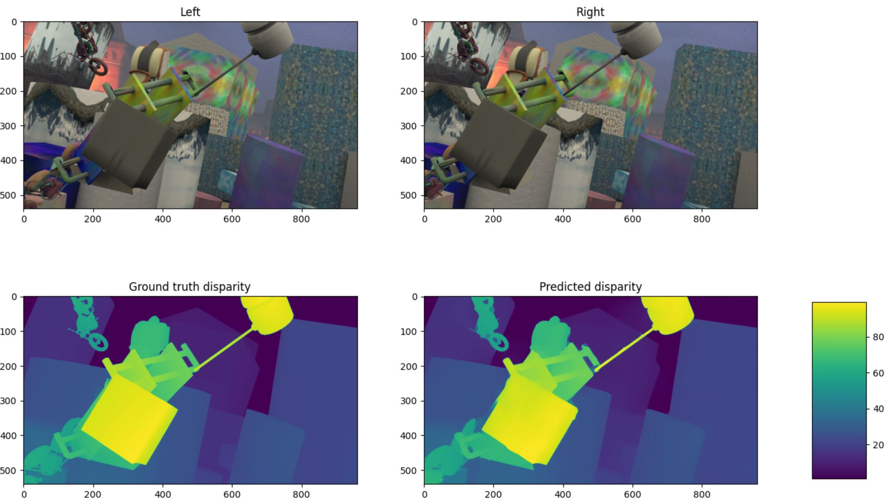

# StereoNet implemented in PyTorch


Install with:
```
pip install "git+https://github.com/andrewlstewart/StereoNet_PyTorch"
```

How to perform the most basic inference:

```
import numpy as np
import torch
from stereonet.model import StereoNet
from stereonet import utils as utils

# Load in the image pair as numpy uint8 arrays
# sample = {'left': utils.image_loader(path_to_left_rgb_image_file),
#           'right': utils.image_loader(path_to_right_rgb_image_file)
#           }

# Here just creating a random image
rng = np.random.default_rng()
sample = {'left': (rng.random((540, 960, 3))*255).astype(np.uint8),  # [height, width, channel],
          'right': (rng.random((540, 960, 3))*255).astype(np.uint8)  # [height, width, channel]
          }

# Transform the single image pair into a torch.Tensor then into a
# batch of shape [batch, channel, height, width]
transformers = [utils.ToTensor(), utils.PadSampleToBatch()]
for transformer in transformers:
    sample = transformer(sample)

# Load in the model from the trained checkpoint
# model = StereoNet.load_from_checkpoint(path_to_checkpoint)

# Here just instantiate the model with random weights
model = StereoNet()

# Set the model to eval and run the forward method without tracking gradients
model.eval()
with torch.no_grad():
    batched_prediction = model(sample)

# Remove the batch diemnsion and switch back to channels last notation
single_prediction = batched_prediction[0].numpy()  # [batch, ...] -> [...]
single_prediction = np.moveaxis(single_prediction, 0, 2)  # [channel, height, width] -> [height, width, channel]

single_prediction.shape
>>> (540, 960, 1)
```

## Weights
Model checkpoint can be downloaded here: https://www.dropbox.com/s/9gpjfe3r1rfch02/epoch%3D20-step%3D744533.ckpt?dl=0

* Max disparity parameter during training = 256 with the mask applied
* 3 downsampling (1/8 resolution) and 3 refinement layers
* Validation EPE of 3.93 for all pixels (including >256).

## Notes

**Currently training (2021-10-03) (~12hrs per epoch on my 1070)**

Implementation of the StereoNet network to compute a disparity map using stereo RGB images.

Currently training, early results are decent.  Validation EPE  pixels when using a maximum disparity mask of 256; ie. during training, no penalty is added to the loss value for disparities in the ground truth >256.

Epoch 20:



Implemented using PyTorch Lightning as a learning exercise to learn about stereo networks, PyTorch, and PyTorch lightning.  Feel free to make any comments or recommendations for better coding practice.

Currently implemented

* Downsampling feature network with `k_downsampling_layers`
* Cost volume filtering
    * When training, a left *and* right cost volume is computed with the loss arising from the mean of the losses of left and right disparity delta to ground truth.
* Hierarchical refinement with cascading `k_refinement_layers`
* Robust loss function [A General and Adaptive Robust Loss Function, Barron (2019)](https://arxiv.org/abs/1701.03077)

Two repos were relied on heavily to inform the network (along with the actual paper)

Original paper: https://arxiv.org/abs/1807.08865

X-StereoLab: https://github.com/meteorshowers/X-StereoLab/blob/9ae8c1413307e7df91b14a7f31e8a95f9e5754f9/disparity/models/stereonet_disp.py

ZhiXuanLi: https://github.com/zhixuanli/StereoNet/blob/f5576689e66e8370b78d9646c00b7e7772db0394/models/stereonet.py

I believe ZhiXuanLi's repo follows the paper best up until line 107 (note their CostVolume computation is incorrect)
    https://github.com/zhixuanli/StereoNet/issues/12#issuecomment-508327106

X-StereoLab is good up until line 180.  X-StereoLab return both the up sampled and refined independently and don't perform the final ReLU.

I believe the implementation that I have written takes the best of both repos and follows the paper most closely.

Noteably, the argmin'd disparity is computed prior to the bilinear interpolation (follows X-Stereo but not ZhiXuanLi, the latter do it reverse order).

Further, neither repo had a cascade of refinement networks and neither repo trained on both the left *and* right disparities.  I believe my repo has both of these correctly implemented.

The paper clearly states they use (many) batch norm layers while simultaneously using a batch size of 1.  I find this interesting.  I naively tried training on random 50% crops (same crop applied to left/right/and disparities) so that I could get more samples into a batch but I think I was losing too many features so the EPE was consistently high.  Currently, training using a single sample (left/right images and left/right disparity).  I still needed to crop down to 513x912 images in order to not run into GPU memory issues.

Currently unclear

* Do I need to have a max_disps parameter to help the model learn faster/better?
* How do the original authors come up with 360k parameters in their model without refinement layers.  Maximum I can conceivable calculate is [~280k](./readme_images/questions.md)...